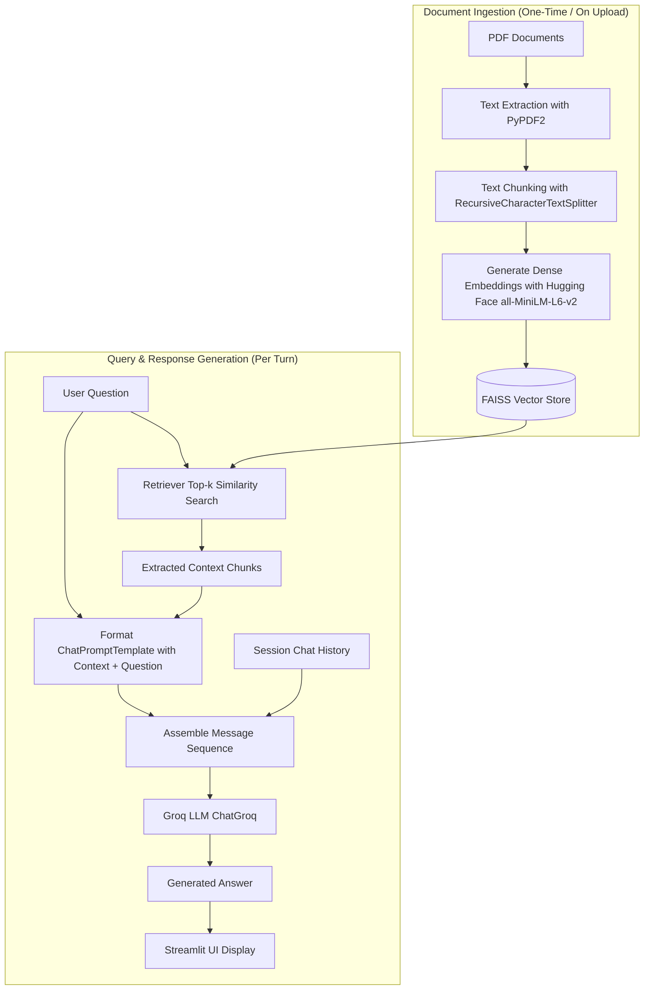

# Chat with Multiple PDFs : RAG-based Document Q&A Application

## 1. Overview

This project is a web-based document question-and-answering application built with **Streamlit**, **LangChain**, and **Groq**. It allows users to upload one or multiple PDF files, automatically process and index their content, and ask natural language questions about the uploaded material through an interactive chat interface.

The application uses a **Retrieval-Augmented Generation (RAG)** architecture. Rather than sending entire documents to the Large Language Model (LLM)—which is constrained by context window limits and API costs—the system retrieves only the text segments most relevant to the user's question, injects them into an instruction prompt, and queries the LLM for a factual, grounded response.

---

## 2. Key Features

- **Multi-Document Ingestion:** Upload and process single or multiple PDF documents simultaneously.
- **Local Semantic Embeddings:** Uses Hugging Face's `all-MiniLM-L6-v2` via `sentence-transformers` for offline vector generation without third-party embedding API costs.
- **In-Memory Vector Search:** Stores dense vectors and performs top-$k$ similarity search using **FAISS** (Facebook AI Similarity Search).
- **Fast Cloud LLM Inference:** Integrates with the **Groq API** via `langchain-groq` for low-latency response generation.
- **Explicit RAG Implementation:** Connects retrieval, prompt assembly, and LLM invocation directly using modern LangChain components rather than rigid, monolithic chain abstractions.
- **Session-Based Chat History:** Maintains conversational flow across turns within the active Streamlit session.
- **Native Streamlit Chat UI:** Built with `st.chat_input` and `st.chat_message` for a responsive user interface.

---

## 3. Architecture / Workflow

The diagram below illustrates the end-to-end data flow:



### End-to-End Pipeline
1. **Document Ingestion:** PDFs $\rightarrow$ Text Extraction $\rightarrow$ Text Chunking $\rightarrow$ Hugging Face Embeddings $\rightarrow$ FAISS Vector Store.
2. **Query & Retrieval:** User Question $\rightarrow$ Retriever $\rightarrow$ Relevant Context Chunks.
3. **Augmented Generation:** Context + Question $\rightarrow$ Prompt Template $\rightarrow$ Groq LLM $\rightarrow$ Answer.

---

## 4. Tech Stack

| Technology | Role / Purpose |
| :--- | :--- |
| **Python** | Core programming language for logic, orchestration, and interface. |
| **Streamlit** | Web application framework providing file uploaders and interactive chat widgets. |
| **LangChain (`langchain-core`, `langchain-community`)** | Framework components for text splitting, prompt templates, and integration wrappers. |
| **Hugging Face (`sentence-transformers`, `langchain-huggingface`)** | Computes dense vector embeddings locally using the `all-MiniLM-L6-v2` model. |
| **FAISS (`faiss-cpu`)** | Vector database library used for in-memory indexing and cosine/L2 similarity search. |
| **Groq API (`langchain-groq`)** | High-speed LLM inference engine hosting models such as `openai/gpt-oss-20b` or `llama-3.1-8b-instant`. |
| **PyPDF2** | Reads and extracts raw textual data from uploaded PDF files. |
| **python-dotenv** | Loads environment variables (e.g., `GROQ_API_KEY`) from a local `.env` file into runtime memory. |

---

## 5. How RAG Works in This Project

Retrieval-Augmented Generation (RAG) bridges the gap between static LLM knowledge and private or domain-specific documents. The process consists of two stages:

### A. Document Ingestion (Indexing Phase)
1. **Text Extraction:** When PDFs are uploaded, `PyPDF2.PdfReader` iterates over each page and extracts the text content into a single string.
2. **Chunking:** The continuous text is divided into segments of 1,000 characters with a 200-character overlap using `RecursiveCharacterTextSplitter`. Overlap ensures sentences split across boundaries do not lose context.
3. **Embedding Generation:** Each chunk is passed through `all-MiniLM-L6-v2`, mapping textual data to a 384-dimensional dense numerical vector.
4. **Vector Storage:** The vectors and their corresponding text chunks are stored in an in-memory FAISS index.

### B. Query-Time Retrieval & Generation
1. **Vector Search:** When the user enters a question, the retriever converts the query into an embedding and calculates vector distance to retrieve the top $k=4$ most similar chunks.
2. **Context Assembly:** The raw text of the 4 chunks is combined into a single `context` block.
3. **Prompt Formatting:** The context and user question are injected into a `ChatPromptTemplate` instructing the LLM to base its response strictly on the retrieved context.
4. **LLM Invocation:** The formatted prompt and prior chat history are submitted to Groq via `ChatGroq.invoke()`, which streams back the final response.

---

## 6. Project Structure

```text
project/
├── app.py              # Main application script containing UI and RAG logic
├── requirements.txt    # Pinned dependency packages for reproducible builds
├── .env                # Local environment file (API keys; excluded from git)
├── .gitignore          # Git ignore rules for environments, cache, and secrets
└── README.md           # Project documentation
```

---

## 7. Prerequisites

- **Python:** Version 3.10, 3.11, or 3.12 installed.
- **Groq API Key:** A valid API key obtained from [Groq Cloud Console](https://console.groq.com).
- **Internet Connection:** Required for initial model download from Hugging Face and for making API calls to Groq.

---

## 8. Installation

1. **Clone the repository:**
   ```bash
   git clone https://github.com/<your-username>/<your-repo-name>.git
   cd <your-repo-name>
   ```

2. **Create and activate a virtual environment:**
   - **Windows (PowerShell):**
     ```powershell
     python -m venv .venv
     .\.venv\Scripts\Activate.ps1
     ```
   - **macOS / Linux:**
     ```bash
     python3 -m venv .venv
     source .venv/bin/activate
     ```

3. **Install the dependencies:**
   ```bash
   pip install -r requirements.txt
   ```

---

## 9. Environment Variables

Create a file named `.env` in the root of the project directory:

```env
GROQ_API_KEY=your_api_key_here
```

Replace `your_api_key_here` with your actual Groq API key. The application uses `python-dotenv` to automatically load this key during startup.

---

## 10. Running the Application

Execute the following command from the root directory:

```bash
streamlit run app.py
```

Streamlit will start a local server and display the application URL (typically `http://localhost:8501`).

---

## 11. How to Use

1. **Upload Documents:** In the left sidebar under "Your documents", click **Browse files** and select one or more PDF files.
2. **Process PDFs:** Click the **Process** button. The app extracts text, splits chunks, computes embeddings, and builds the FAISS index.
3. **Confirm Ingestion:** A green success message indicating `Processed X chunks!` will appear once indexing is complete.
4. **Chat with Documents:** Type your question into the chat input bar at the bottom and press **Enter**.
5. **View Responses:** The assistant answers using the extracted document context and preserves previous turns in the chat view.

---

## 12. Code Explanation

[`app.py`](app.py) is organized into clear functional components:

- **`get_pdf_text(pdf_docs)`:** Iterates through uploaded PDF files and pages using `PdfReader`, extracting and concatenating all text.
- **`get_text_chunks(text)`:** Takes the extracted raw text and splits it into manageable segments using `RecursiveCharacterTextSplitter(chunk_size=1000, chunk_overlap=200)`.
- **`get_rag_components(chunks)`:** Initializes the Hugging Face embedding model, creates the FAISS vector store, configures the retriever ($k=4$), instantiates `ChatGroq`, and builds the `ChatPromptTemplate`.
- **`answer_question(question)`:** Coordinates retrieval and generation for a user turn. Retrieves matching chunks with `retriever.invoke()`, formats the prompt with combined context, passes conversation messages to `llm.invoke()`, and updates `st.session_state.messages`.
- **`main()`:** Manages UI configuration, session state initialization (`retriever`, `llm`, `prompt`, `messages`), sidebar uploads, and chat message rendering.

---

## 13. Important Design Decisions

- **Text Chunking:** LLMs have context window limits, and embedding entire documents as a single vector reduces retrieval specificity. Splitting text into 1,000-character segments preserves semantic granularity.
- **Embeddings vs. Keyword Search:** Semantic vector embeddings capture meaning and intent rather than exact keyword matches, enabling the system to retrieve relevant sections even when phrasing differs.
- **In-Memory FAISS:** For exploratory and session-based tasks, an in-memory FAISS index requires no separate database server, simplifying setup while delivering fast vector comparisons.
- **Manual RAG Pipeline vs. Monolithic Chains:** Instead of relying on legacy `ConversationalRetrievalChain` constructs, connecting retrieval, prompt formatting, and LLM invocation directly provides clarity, stability, and easier prompt tuning.
- **Streamlit Session State:** Streamlit reruns the script on each user interaction. Storing `vectorstore`, `retriever`, `llm`, and `messages` in `st.session_state` prevents re-indexing documents on every chat turn.

---

## 14. Limitations

- **Text-Only Extraction:** `PyPDF2` cannot extract text from scanned, image-based, or non-OCR PDFs.
- **Fixed Retrieval Parameters:** Fixed chunk size (1,000 characters) and fixed retrieval count ($k=4$) may not be optimal for all document structures (e.g., complex tables or short receipts).
- **Single-Turn Query Retrieval:** Retrieval is performed using the user's latest query directly. Follow-up questions relying heavily on pronouns (e.g., *"What did he say about that?"*) are not yet rewritten into standalone search queries.
- **Volatile Storage:** The FAISS index resides in memory during the active session and is discarded when the server restarts or the browser session resets.
- **API Dependency:** The generation stage requires network connectivity to reach the Groq API endpoint.

---

## 15. Future Improvements

- [ ] **History-Aware Query Rewriting:** Implement a preliminary LLM step to reformulate follow-up questions into standalone search queries.
- [ ] **OCR Ingestion Support:** Add `pytesseract` or `pdf2image` to process scanned and image-only PDF files.
- [ ] **Source Citations:** Include page numbers and document names alongside generated responses.
- [ ] **Persistent Vector Storage:** Support persistent on-disk stores (e.g., Chroma, FAISS disk serialization).
- [ ] **Multi-Format Ingestion:** Expand loaders to support `.docx`, `.txt`, `.md`, and `.csv` files.
- [ ] **Configurable Parameters:** Provide UI sliders in the sidebar for chunk size, chunk overlap, and top-$k$ retrieval depth.

---

## 16. Security Considerations

- **API Keys:** Never hardcode or commit `GROQ_API_KEY` to source control. Always use `.env` files.
- **`.gitignore` Configuration:** Ensure `.env`, `.venv/`, and `__pycache__/` are explicitly added to `.gitignore`.
- **Data Privacy:** Document contents retrieved during processing are transmitted to the Groq API for completion generation. Avoid processing sensitive or confidential documents on untrusted networks or shared API keys.

---

## 17. Example Usage

Once your documents are processed, you can ask queries such as:

1. *"What are the main objectives and conclusions described in the introduction?"*
2. *"Summarize the methodology outlined in Section 3 in bullet points."*
3. *"What key risks or challenges are identified in the document?"*
4. *"Does the text provide any specific dates, deadlines, or milestones?"*

---

## 18. Troubleshooting

| Issue | Cause | Solution |
| :--- | :--- | :--- |
| **"Could not extract any text from the PDF"** | The uploaded file is scanned, password-protected, or contains raster images only. | Ensure the PDF contains selectable text or run OCR preprocessing on the file first. |
| **`groq.AuthenticationError` / Invalid API Key** | Missing or incorrect `GROQ_API_KEY` in `.env`. | Verify that the `.env` file exists in the project root and contains a valid key from [Groq Console](https://console.groq.com). |
| **`ModuleNotFoundError: No module named '...'`** | Dependencies were not installed or virtual environment is inactive. | Activate `.venv` and run `pip install -r requirements.txt`. |
| **Hugging Face Model Download Timeout** | Slow or restricted internet connection on first run. | Ensure network access is available during the initial run so `all-MiniLM-L6-v2` can download to your local cache. |
| **"Please upload and process your PDFs first"** | A question was submitted before clicking **Process**. | Upload documents and click **Process** in the sidebar before entering a chat prompt. |

---

## 19. Learning Outcomes

Working through this project provides practical experience with:
- **Retrieval-Augmented Generation (RAG):** Understanding how to augment LLM capabilities with proprietary or external context.
- **Dense Vector Embeddings:** How semantic representations are generated using transformer-based embedding models.
- **Vector Search & FAISS:** Indexing vector spaces and executing cosine/Euclidean nearest-neighbor search.
- **Modern LangChain:** Assembling modular RAG pipelines with explicit prompt templates and retrieval components.
- **Groq API Integration:** Interacting with hosted LLM providers using standard chat protocols.
- **Streamlit State Management:** Building interactive web applications that manage state across render cycles.

---

## 20. License

This project is for educational and portfolio purposes.
